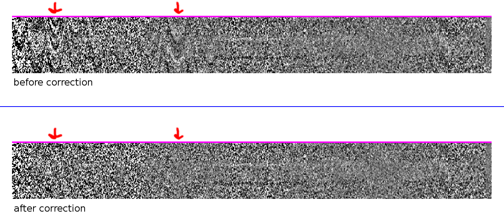

# Instructions X-SHOOTER reduction

# Table of content

<!-- MarkdownTOC autolink=true bracket=round -->

- [Introduction](#introduction)
- [Preparing your computer](#preparing-your-computer)
- [Prepare the X-SHOOTER data](#prepare-the-x-shooter-data)
- [Produce 2D spectra](#produce-2d-spectra)
- [Produce 1D spectra, a first reduction](#produce-1d-spectra-a-first-reduction)
- [Better darks](#better-darks)
- [Telluric correction](#telluric-correction)
- [Rescaling to photometry](#rescaling-to-photometry)
- [Adjusting the models to extract 1D spectra](#adjusting-the-models-to-extract-1d-spectra)
- [Other tweaks](#other-tweaks)

<!-- /MarkdownTOC -->


# Introduction

These instructions will tell you how to reduce X-SHOOTER data using the ESO esorex/reflex pipeline (for producing science-ready 2D spectra) and custom tools (for extracting, rescaling and combining 1D spectra).


# Preparing your computer

To start with, you must install the esorex/reflex pipeline. Go to the following webpage and follow the installation instructions:

https://www.eso.org/sci/software/pipelines/xshooter/

There is no need to install ```gasgano```, so you can skip this step. But ```EsoReflex``` is mandatory.

You must then compile the tools in this repository. To do so, first go to a directory somewhere in your home folder where you want to store the programs (in the following I will assume ```/home/<user>/code/```), clone the github repository:

```bash
git clone https://github.com/cschreib/speclib.git
```

This will create directory called ```speclib```. Now execute the following commands:

```bash
cd speclib

cd xshooter
mkdir build
cd build
cmake ../
make install
cd ..

cd generic
mkdir build
cd build
cmake ../
make install
```

For this to work, you must have ```git``` and ```cmake``` installed on your computer. They are most likely already installed; if not, you can use your distribution's package managed (or MacPorts in OSX) to install then (e.g., ```sudo apt-get install git cmake```).

If you care about rescaling spectra to photometry, you will also need a filter response curve database. To download one, simply execute the command below inside the ```speclib``` directory:

```bash
git clone https://github.com/cschreib/filter-db.git
```


# Prepare the X-SHOOTER data

These instructions must be followed for each OB separately. Uncompress the data given by ESO (each OB in a different directory).

```bash
for f in *.Z; do gzip -d $f; done
```

With a terminal, go into this directory and run the ```rename``` tool:
```bash
/home/<user>/code/speclib/xshooter/rename ./
#     ^^^^^^^^^^^^^^^^^^^ <- modify this
```

This will analyze all the FITS files provided by ESO and identify their purposes. It will then rename the files to add suffixes that help you figuring out which file contains what. This will not affect the pipeline or the content of the files in any way, but it is extremely convenient for exploring the data and figuring out what is going on.

The most important frames:
  - ```*sci-[uvb/vis/nir].fits```: science images (for both A and B positions, in UVB, VIS, or NIR arms).
  - ```*acq.fits```: acquisition images (bright stars used to position the telescope before the science runs)
  - ```*std-telluric-[uvb/vis/nir].fits```: telluric standard observations

There could be a number of files starting with ```M.XSHOOTER...``` remaining in the directory. You can ignore these; they are pre-reduced calibration files (could be useful, but I never got them to work).


# Produce 2D spectra

Follow the ESO instructions to start EsoReflex, and open the X-SHOOTER pipeline (Xshooter.xml file). This will seem atrociously complicated, and it is. Fortunately the default behavior of the pipeline is very decent in most cases, so we won't adjust any detail here and simply let it run unsupervised, which is fairly easy. If you ever feel lost, take a look at the [official tutorial](ftp://ftp.eso.org/pub/dfs/pipelines/xshooter/xshoo-reflex-tutorial-2.17.pdf).

Set the ```ROOT_DATA_DIR``` variable to point to the directory where you want to store the 2D spectra produced by the pipeline. To do so, double click on the variable and use the dialog to navigate to the directory. Once you found it, press OK and make sure the variable has been correctly updated (I have seen cases where it did not, and I had to repeat the procedure once again...). Do the same with ```RAW_DATA_DIR```, and make it point to the directory in which you  stored the X-SHOOTER raw data for the first OB, in the previous step. Finally, make sure the ```CALIB_DATA_DIR``` is correct and points to the X-SHOOTER calibration data directory (for example, for me it was ```/home/cschreib/programming/xshooter/calib/xshoo-2.9.3```).

Once you're done, click the "Run" button (green "play" button at the top). The pipeline will analyze the directories you setup, and look for data to reduce. If all goes well, it will identify your OB and list a couple different data sets, typically one per arm, and separating science observations from telluric standards (if you have any). Look for the column ```SEQ.ARM``` to know the arm corresponding to a data set (UVB, VIS, or NIR). The ```OBJECT``` column should tell you the observed target (```STD,TELLURIC``` for telluric standard, and whatever target name you set for your program for science observations).

Some data sets will be grayed-out if files are missing such that they cannot be reduced. This is difficult to diagnose because EsoReflex will not be very helpful in telling you exactly what is missing... Refer to the manual when this happens, and good luck. Otherwise, select all the data sets you want to reduce (e.g., if you only care about the NIR data you can completely ignore the UVB and VIS data, the pipeline will always reduce them independently anyway). Then press "Continue".

The pipeline will run for a while, and occasionally pop up some windows with plots that you can inspect. For all the programs I had to deal with, there was nothing for me to do at these stages, so I checked the "Disable this window in subsequent runs" option (this only applies until you close and re-open EsoReflex, so don't be afraid of using it). Then click "Continue Wkf".

After a while, the pipeline will be finished and will display the list of reduced files. When this happens, you can change the path of ```RAW_DATA_DIR``` and make it point to the next OB, and start again.

The pipeline will store its products in the ```reflex_end_products/<date>/<dataset>``` directory. The ```<date>``` corresponds to the precise date (down to milliseconds...) at which the reduction of the OB was finished. This is pretty obscure and starts becoming a mess when you have many OBs to reduce, or when you try and fail many times (indeed, it will create a directory for each attempt).

For this reason, as soon as the products are reduced, I copy the files into another directory where I know how to locate things easily. Here is the organization I follow. I have a root directory for each target observed with X-SHOOTER, which contains two main directories: ```raw``` (contains the pipeline reduced 2D spectra), and ```reduced``` (contains the final 1D spectra, individual and stacked). Inside the ```raw``` directory, I create a different sub-directory for each separate OB. I typically call them ```A```, ```B```, ```C```, etc, in the order in which they were observed. Inside each of these directories, I copy the directories produced by the pipeline in ```reflex_end_products/...```. These are called, e.g., ```XSHOO.2018-02-19T00:33:32.911-sci_tpl```. I rename them to remove the ```-sci_tpl``` suffix and replace it by the name of the arm, so this example becomes ```XSHOO.2018-02-19T00:33:32.911-UVB```. In the end I end up with something like:

```bash
my_source/
 - raw/
    - A/
       - XSHOO.2018-02-19T00:33:32.911-UVB/
           SCI_SLIT_FLUX_MERGE1D_UVB.fits
           SCI_SLIT_FLUX_MERGE2D_UVB.fits
           ...
       - XSHOO.2018-02-19T00:33:38.091-VIS/
           SCI_SLIT_FLUX_MERGE1D_VIS.fits
           SCI_SLIT_FLUX_MERGE2D_VIS.fits
           ...
       - ...
    - B/
       - ...
```

This is a bit tedious to do manually every time, and I have not gotten around to script this part. But it only needs doing once, then you can work on the 2D spectra much more conveniently. The scripts I discuss below assume the above directory structure and filenames, so I recommend you adopt the same (or be willing to adjust the scripts yourself).


# Produce 1D spectra, a first reduction

By default, the pipeline will extract a 1D spectrum for each of your OBs, with some default setup. I never used these, as I wanted to make my own (supposedly more optimal) extraction. In particular, the pipeline is not very adequate to handle cases where there are multiple sources to extract in a single slit, and which must be de-blended (or at least masked).

As a starting point, copy the file ```reduce.sh``` present in this repository and place it at the root of your project (e.g., inside the ```my_source/``` folder in the example above). Open it with your text editor, and change the options to your liking/situation. Look for all the comment lines starting with ```# MODIFY``` to spot all the places where you should most likely modify the file.

To start with, we'll produce the simplest possible reduction, and we'll build up from there into a more advanced and better quality reduction. For now, pay close attention to the options below and modify if necessary:

* ```SPECLIB_DIR```: write down here the path to the ```speclib``` directory.
* ```ARMS```: select which arms you want to reduce.
* ```DEFAULT_SEEING```: default value for seeing (can be overridden on an OB-to-OB basis later).
* ```OBS```: list your OBs there.
* ```TARGET```: set the name of this pointing (a target can contain multiple sources)
* ```SOURCES``` and ```SOURCES_xxx```: specify here the properties of the sources to extract in this target. There can be one or more sources to extract, if the slit covered multiple objects. Be particularly careful in setting the ```SOURCES_POS``` and ```SOURCES_WIDTH``` lists, which define respectively the position along the slit and the radii of the sources to extract. Probably you have a deep broadband image of your system from which you can estimate this. You can also try different values and iterate until you've found something good. Below, I'll assume you have two sources to extract, and that you called them ```blobA``` and ```blobB```.

Once you're satisfied with the options listed above, execute the script (there are a number of other options to investigate, but we'll cover them later). The script will print a number of things in the terminal to inform you of the progress, and eventually complete execution.

If all goes well, you'll have a new directory called ```reduced```. This directory will contain a sub-directory for each OB you reduced, containing the individual 1D spectra for each OB. This is useful for inspection of the data, to see if one OB in particular is particularly bad and should be excluded (or cured in some way). At this stage, look in particular at the ```..._spec2d.fits``` and ```..._spec2d_residual.fits```. These are, respectively, the 2D spectra before and after subtracting the source models. Look for horrible residuals, which could indicate a mistake in the ```SOURCES_xxx``` above. The ```..._profile.fits``` files show you the wavelength-averaged spatial profiles (first HDU) and its uncertainty (second HDU), in which you may be able to detect your sources and obtain better guesses of their spatial properties. This file also contains the models for each source (third HDU onwards).

If these individual 2D spectra look OK, you can inspect the stacked spectra. These are saved in one sub-directory per source (as listed in ```SOURCES```, e.g., ```blobA``` and ```blobB```). Look inside one of them, and start by inspecting the stacked and binned 2D spectrum (```..._spec2d_b30.fits```) and its residual (```..._spec2d_sub_b30.fits```). The latter is the residual after subtracting this source only (not the other sources). Looking at the binned spectrum is a good way to identify if there is signal (or issues) in the data, because X-SHOOTER has a pretty high spectral resolution and it's less likely you will detect something at the native spectral scale. If the 2D spectrum look OK, you can look at the 1D spectrum (```stacked_<arm>.fits```) or a binned version (```stacked_<arm>_b30.fits```).

This is the most basic reduction, and a good baseline to save aside when trying to improve the reduction, to check whether you're indeed gaining in S/N or quality of the spectrum. The next sections will show you how you can attempt to improve this.


# Better darks

There seems to be some issue in the dark level in the NIR detector, where the dark current varies over the course of one integration, such that a) a dark frame taken the same day during day-time calibration will not full subtract the dark current, and b) it also does not subtract perfectly when nodding. This is particularly visible in STARE mode and less so (but still noticeable) in NOD mode. Unfortunately the method described below only works for NOD observations.

The residual dark current forms easily recognizable patterns in the raw frames, which can be identified and corrected. This must be done on the raw data, where the patterns are simple; after the data is rectified this becomes much more complex.

To perform the correction, go to the directory where you extracted the raw frames (downloaded from the ESO archive), and step inside the directory of the first OB. In the EsoReflex directory, locate the ```reflex_tmp_products/xshooter/xsh_2dmap_1/...``` directory corresponding to this OB (as this is indexed by time of reduction, this can be a little tricky...), and look for a file called ```WAVE_MAP_NIR.fits```. Note down the path to this file. Now make a backup of the data in a sub-directory (call it ```orig```), as we will modify the raw data and we want to be able to come back to the original data if needed. Then call the following command:

```bash
/home/<user>/code/speclib/xshooter/correct_dark orig ./ <path_to>/WAVE_MAP_NIR.fits
#     ^^^^^^ <- modify this                             ^^^^^^^^^ <- modify this
```

Once this is done, repeat this operation for all the OBs. Then re-run the EsoReflex pipeline from scratch (yes!), and re-do the reduction of the 1D spectra. You can then compare the improvement between the original and dark-corrected spectra. The difference should be most visible in the binned 2D spectra; the original data will show weird arcs (positive and/or negative) and the corrected data should be more homogeneous, as in the image below.




# Telluric correction

The pipeline has reduced telluric standard stars (if you had some in your data), but has not applied any correction. We will see here how to perform this correction, which is very easy. It should only be necessary/useful if you're a) looking for continuum features (absorption lines, etc.), or b) interested in having precise line fluxes. If all you care about is determining a redshift, you can probably skip this.

First we'll have to copy the reduced telluric spectra in the ```raw``` folder for the ```reduce.sh``` script to find them. For each OB, go in the ```reflex_end_products/.../``` directory of the OB and identify the files ending with ```...-std-telluric_tpl```. There are typically a few telluric stars, taken at different elevation. You should try to pick the one that has the closest elevation to your data. To determine this, open the ```..._MERGE2D_<arm>.fits``` file (does not matter which arm) and look inside the header for the keyword named ```HIERARCH ESO TPL AIRM START```, and do the same for the first frame of your OB. Also inspect the 2D spectrum of the telluric standard to make sure it looks clean. When you have found the best star, copy all the files inside the ```raw/<OB>/telluric``` directory (changing ```<OB>``` to the name of the OB).

Finally, to enable telluric correction, go back to the ```reduce.sh``` script and locate the line ```DO_TELLURIC=0```. Change this to ```1```, and re-run the script. The script will first analyze the telluric standard spectrum, extract the necessary correction, and apply it to the science spectrum before stacking.

You can check the quality of the telluric correction using the ```plot_telluric.pro``` IDL script in this repository.


# Rescaling to photometry

Another way to improve the reduction is to flux-calibrate the OBs before they are stacked, to remove variations of the effective transmission (telescope + atmosphere). This has several advantages. First, since the final error bars are determined from the variance between exposures, these error bars will be over-estimated if the transmission varies significantly. Second, since the stack is performed using inverse variance weighting, this will naturally weight down the exposures with poor transmission. So this is generally a good thing to do.

However, for this to work at all, you need to have at least one of your sources with some detectable continuum emission (possibly after aggressive binning). If you know your sources are effectively pure emission line sources with very faint continuum, you will not be able to use this method. You also need to have a photometric catalog ready. This photometric catalog must be a FITS table with a particular format. It can be created in IDL with the following code:

```IDL
; First, read your catalog.
; Second, arrange the data in the following variables:
;  * id : an array of integers, the IDs of each galaxy in the catalog.
;  * flux : a 2D array of float/double, containing the fluxes in uJy.
;           The first dimension is for each band, the second dimension is for each galaxy.
;           So if I want the flux in the band 'b' for the galaxy 'i', I write: 'flux[b,i]'.
;           Non-detections or invalid fluxes must be set to '!values.f_nan'.
;  * flux_err : same as 'flux', but for flux uncertainties.
;  * bands : an array of strings (code names) that identifies each photometric band.
;            For example, the band 'b' has for code name 'bands[b]'.
;            These names must match with names of response filters in the 'filter-db/db.dat'
;            file that you should have downloaded earlier.

; Example
ngal = 1000 ; we have 1000 galaxies in the catalog
nband = 3   ; we have 3 photometric bands

; Create the arrays
id       = indgen(ngal)+1 ; [1, 2, 3, etc.]
flux     = fltarr(nband, ngal)
flux_err = fltarr(nband, ngal)
bands    = strarr(nband)

; Fill them up with data
bands[0] = 'vista_J' ; UltraVISTA J band
flux[0,*] = ...      ; flux of all galaxies in J band
flux_err[0,*] = ...  ; uncertainties of all galaxies in J band

bands[1] = 'vista_H' ; UltraVISTA H band
flux[1,*] = ...      ; flux of all galaxies in H band
flux_err[1,*] = ...  ; uncertainties of all galaxies in H band
; etc...

; Now write this into a FITS table
mwrfits, /create, {id:id, flux:flux, flux_err:flux_err, bands:bands}, 'catalog.fits'
```

Once you have the catalog ready, write down its path in the ```RESCALING_CATALOG``` variable in ```reduce.sh```. Make sure each of your sources have the right ID specified in ```SOURCES_ID``` (must match a value in the ```id``` column of the catalog). Make sure you have downloaded the filter data base (see instructions above). Then pick a photometric band (or several photometric bands) that are a) fully covered by your spectrum, and b) with available photometry in the flux catalog. List these bands in the ```RESCALING_FILTERS``` variable in ```reduce.sh```. Finally, set the ```DO_RESCALE``` variable to ```1```, and re-run the script.

You should notice that a few more things will get printed in the terminal. In particular the code will tell you what rescaling factor it applied, and if it was able to determine this factor with sufficient accuracy to be of any use (if not, the code simply does not rescale the spectra).


# Adjusting the models to extract 1D spectra

In the instructions above, you were asked to provide a guess for the shape of each of your sources on the slit. If your sources are bright enough, this will be sufficient for the code to find the best models in all cases, and give an optimal extraction. If not (or if your sources have only emission lines and are not detected in the continuum), then the code will probably just use this guess as a best available solution, and go ahead with the extraction. This may be good enough for a first reduction, but you'll eventually need to optimize this if you care about getting the best out of your spectra.

There are a few easy adjustments that one can make to improve on this first guess. The first is to look for systematic shifts along the slit. This can happen if the acquisition was imperfect, or if the telescope drifted for some reason. You can spot these cases visually, either if your sources have marginal S/N in the stacked slit profile (see instructions above on how to visualize this), or if you can see clear emission lines. If you do find significant offsets, you can correct for them manually by tweaking the ```OFFSET``` variable in the ```reduce.sh``` script. It is located somewhat in the middle of the script, away from the other variables (look for ```# MODIFY.``` in the file). This variable is reset to zero for each OB and arm combination, by default, but you can modify it at your own will (there is an example in the script). Positive offsets will "move the pixels up" (or move the reference pixel down; the reference pixel is the pixel which is attributed a position offset of zero arcsec). In a similar fashion, you can adjust the seeing in the ```SEEING``` variable.

Another thing you can do is to look at the stacked 2D spectrum produced in the first reduction, and compute its wavelength-averaged profile. This stacked profile may provide a more significant detections of the source profiles, which you can use to refine your best guesses.


# Other tweaks

The main tool in the reduction is ```extract2d```. This is the tool that opens a 2D spectrum and extracts a 1D spectrum out of it. All the other steps of the reduction are pretty straight forward and there is not much options to optimize, but feel free to look at the respective tools and their options (look in particular at ```stack1d``` which does the stacking of the spectra).

There are a number of options one can tweak in running ```extract2d```. In the ```reduce.sh``` script, these can be conveniently edited in the ```EXTRACT_OPTIONS``` variable. To have a detailed description of all the options, run ```extract2d help```.
